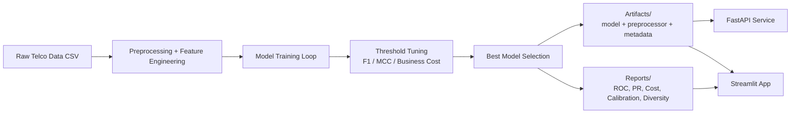

# 📡 Churn Prediction Platform

A full-stack, production-style **telecom churn prediction system** with:

- 🧠 Multi-model training pipeline (tree models + diverse learners + ensembles)
- 🎯 Threshold optimization (F1, MCC, and business-cost aware)
- 🧪 Calibration and diversity analysis
- 🌐 FastAPI backend for inference and portfolio intelligence
- 🖥️ Streamlit app for interactive risk exploration
- 📊 Pre-generated model diagnostics and visuals

---

## ✨ Project Highlights

- **End-to-end workflow** from raw CSV to model artifacts, API, and UI.
- **Business-aligned decisions** via false-negative / false-positive cost modeling.
- **Interpretability support** using SHAP-based top risk factors.
- **Portfolio analytics** endpoints (risk tiers, churn distribution, campaign optimization).
- **Reusable artifacts** for local serving and experimentation.

---

## 🗂️ Repository Structure

```text
Churn-Prediction-/
├── app/
│   ├── api.py                 # FastAPI inference + analytics API
│   └── streamlit_app.py       # Streamlit interactive dashboard
├── Common/                    # Shared data prep, eval, plotting, analysis helpers
├── models/                    # Individual model builders
├── Data/
│   └── WA_Fn-UseC_-Telco-Customer-Churn.csv
├── artifacts/                 # Saved best model + metadata + results
├── reports/                   # Generated model visual reports
├── train.py                   # Main training + reporting pipeline
├── tune.py                    # Optuna tuning for selected models
├── run.py                     # Quick multi-model evaluation runner
└── requirements.txt
```

---

## 🧱 Architecture (High-Level)



---

## 📈 Built-in Visual Reports

> These files are already present in `reports/` and can be regenerated by running training.

### ROC Curves


### Precision-Recall Curves


### Cost Analysis


### Calibration Overview


### Diversity (Disagreement)


---

## 🚀 Quickstart

## 1) Create and activate a virtual environment

### macOS / Linux
```bash
python -m venv .venv
source .venv/bin/activate
```

### Windows (PowerShell)
```powershell
python -m venv .venv
.venv\Scripts\Activate.ps1
```

## 2) Install dependencies

```bash
pip install -r requirements.txt
```

## 3) (Optional but recommended) Re-train models and regenerate artifacts

```bash
python train.py
```

This writes:
- `artifacts/best_model.joblib`
- `artifacts/preprocessor.joblib`
- `artifacts/best_model_info.json`
- `artifacts/results.json`
- report images under `reports/`

---

## 🖥️ Run the App (Server Instructions)

You can run **API backend**, **Streamlit frontend**, or both.

### Option A — Run API server (FastAPI)

```bash
uvicorn app.api:app --reload --port 8000
```

Then open:
- Swagger docs: `http://127.0.0.1:8000/docs`
- Health check: `http://127.0.0.1:8000/health`

### Option B — Run Streamlit app

```bash
streamlit run app/streamlit_app.py
```

Streamlit will show the local URL in your terminal (typically `http://localhost:8501`).

### Option C — Run both together (two terminals)

**Terminal 1**
```bash
uvicorn app.api:app --reload --port 8000
```

**Terminal 2**
```bash
streamlit run app/streamlit_app.py
```

---

## 🔌 API Endpoints (Core)

- `GET /health` — model/service status
- `POST /predict` — single-customer churn prediction
- `GET /portfolio/summary` — aggregate risk and business metrics
- `GET /portfolio/customers` — paginated scored customers
- `POST /whatif` — compare original vs modified customer profile
- `POST /campaign/optimize` — budget-constrained retention targeting
- `GET /models/comparison` — cross-model performance snapshot
- `GET /models/diversity` — pairwise diversity metrics
- `GET /models/calibration` — calibration summary
- `GET /models/des` — dynamic ensemble selection outputs
- `GET /reports/{filename}` — serve report image files

---

## 🧠 Training & Experimentation Commands

### Full training pipeline
```bash
python train.py
```

### Hyperparameter tuning (Optuna)
```bash
python tune.py
# or
python tune.py --trials 100
```

### Lightweight runner (multi-model comparison)
```bash
python run.py
```

---

## 🧪 Input Schema for `/predict`

Expected JSON fields:

- `gender`, `SeniorCitizen`, `Partner`, `Dependents`
- `tenure`, `PhoneService`, `MultipleLines`
- `InternetService`, `OnlineSecurity`, `OnlineBackup`, `DeviceProtection`, `TechSupport`
- `StreamingTV`, `StreamingMovies`, `Contract`, `PaperlessBilling`, `PaymentMethod`
- `MonthlyCharges`, `TotalCharges`
- optional: `threshold` (0.0–1.0)

Use the Swagger UI (`/docs`) for a ready-to-run request template.

---

## ⚙️ Notes & Troubleshooting

- If API startup fails, ensure artifacts exist in `artifacts/`.
  - Fix: run `python train.py` first.
- If SHAP explanations are unavailable, prediction still works (graceful fallback).
- If you change feature engineering or preprocessing, retrain so artifacts remain compatible.

---

## 📌 Recommended Workflow

1. Install dependencies.
2. Run `python train.py` to refresh model + reports.
3. Start API with `uvicorn app.api:app --reload --port 8000`.
4. Start Streamlit with `streamlit run app/streamlit_app.py`.
5. Use `/docs` for API exploration and Streamlit for interactive demos.

---

## 🤝 Contributing

- Keep model builders modular under `models/`.
- Keep shared utilities in `Common/`.
- Regenerate reports after model changes so visuals stay in sync.
