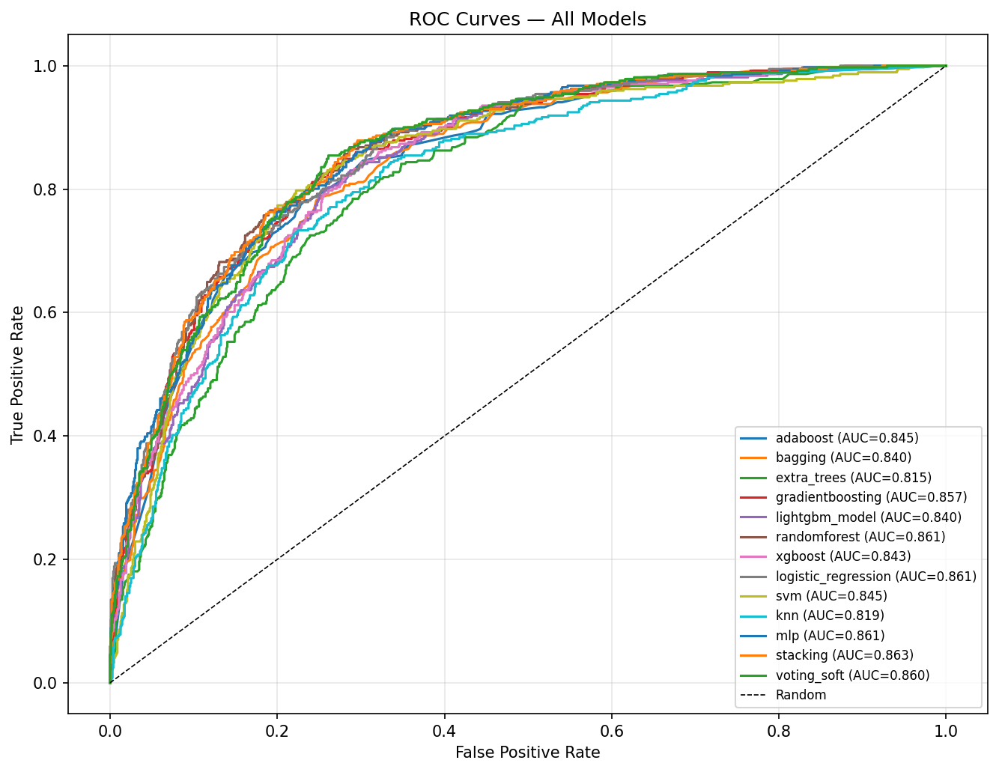
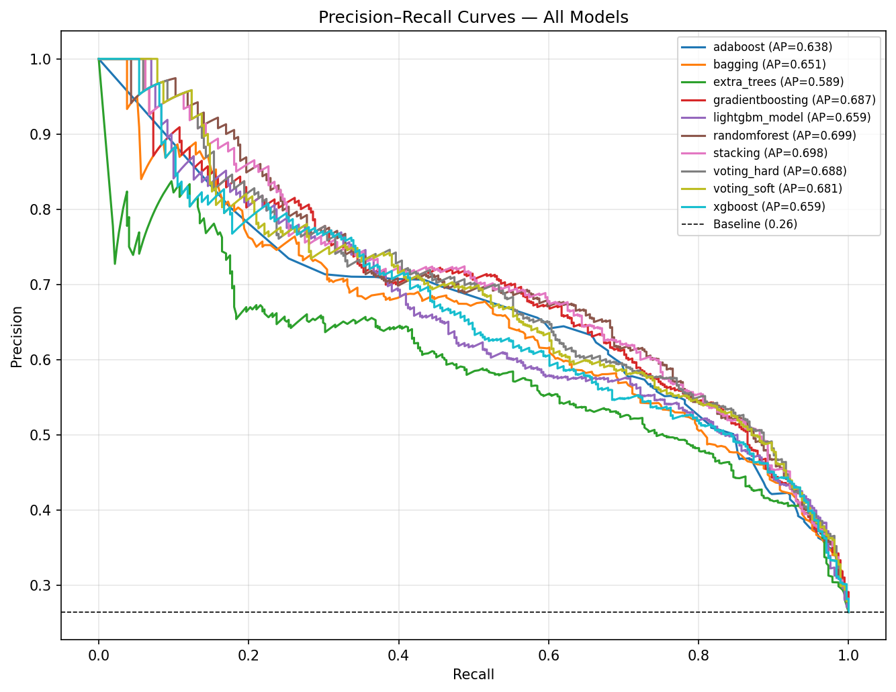
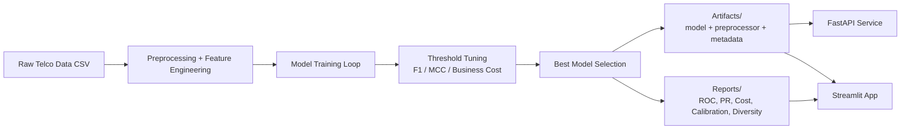
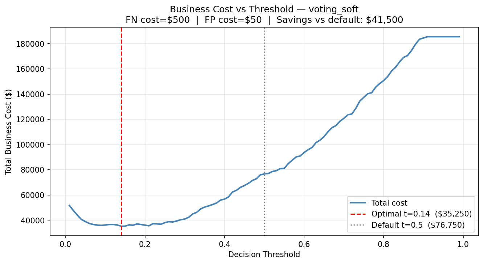
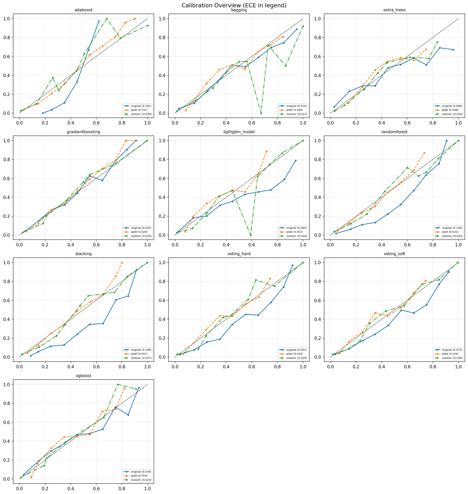
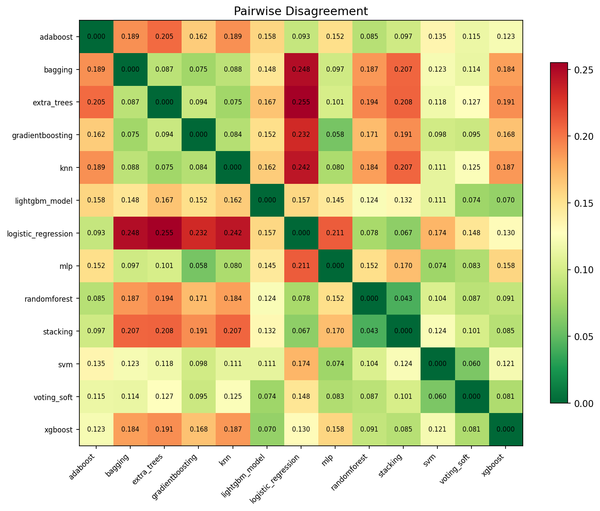
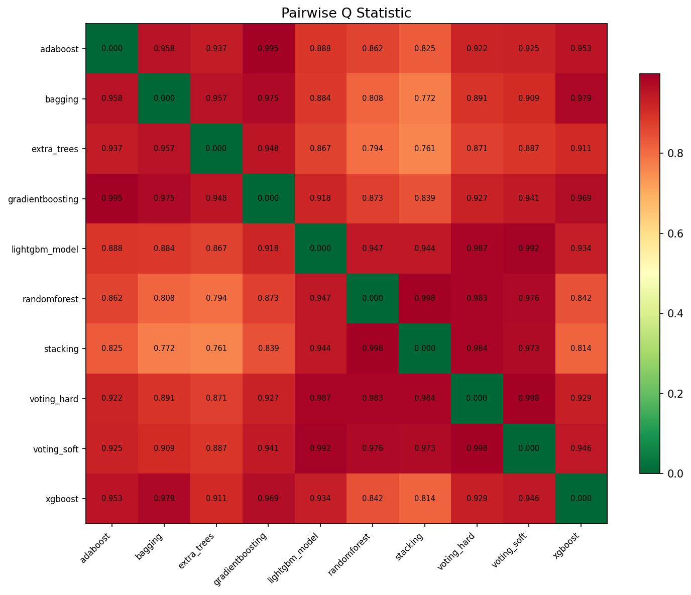
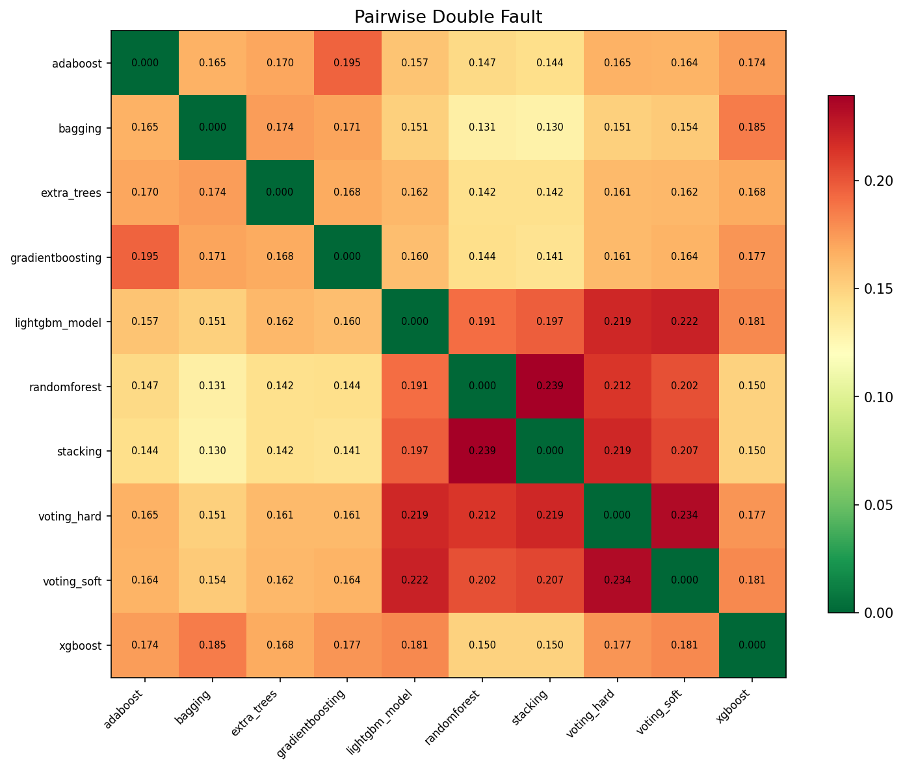

<<<<<<< HEAD
# 📡 Churn Prediction Platform

A full-stack, production-style **telecom churn prediction system** with:

- 🧠 Multi-model training pipeline (tree models + diverse learners + ensembles)
- 🎯 Threshold optimization (F1, MCC, and business-cost aware)
- 🧪 Calibration and diversity analysis
- 🌐 FastAPI backend for inference and portfolio intelligence
- 🖥️ Streamlit app for interactive risk exploration
- 📊 Pre-generated model diagnostics and visuals

---

## ✨ Project Highlights

- **End-to-end workflow** from raw CSV to model artifacts, API, and UI.
- **Business-aligned decisions** via false-negative / false-positive cost modeling.
- **Interpretability support** using SHAP-based top risk factors.
- **Portfolio analytics** endpoints (risk tiers, churn distribution, campaign optimization).
- **Reusable artifacts** for local serving and experimentation.

---

## 🗂️ Repository Structure

```text
Churn-Prediction-/
├── app/
│   ├── api.py                 # FastAPI inference + analytics API
│   └── streamlit_app.py       # Streamlit interactive dashboard
├── Common/                    # Shared data prep, eval, plotting, analysis helpers
├── models/                    # Individual model builders
├── Data/
│   └── WA_Fn-UseC_-Telco-Customer-Churn.csv
├── artifacts/                 # Saved best model + metadata + results
├── reports/                   # Generated model visual reports
├── train.py                   # Main training + reporting pipeline
├── tune.py                    # Optuna tuning for selected models
├── run.py                     # Quick multi-model evaluation runner
└── requirements.txt
=======
<p align="center">
  
</p>

<h1 align="center">Ensemble Learning for Telecom Churn Prediction</h1>

<p align="center">
  <em>A comparative study of 14 classifiers across 4 learning families, with diversity analysis, calibration, cost-sensitive optimization, and a full-stack decision support platform.</em>
</p>

<p align="center">
  
  
  
  
  
</p>

---

## Overview

This project goes beyond training a single churn model. It implements a **complete ensemble learning research pipeline** that:

1. Trains **14 classifiers** from 4 fundamentally different learning families
2. Measures **ensemble diversity** via Q-statistic, disagreement, and double-fault metrics
3. Applies **cost-sensitive threshold optimization** and **probability calibration**
4. Evaluates **Dynamic Ensemble Selection** (DES) methods
5. Deploys predictions through a **production-grade web platform** with 10 interactive pages

<p align="center">
  
</p>

---

## Project Structure

```
Churn Prediction/
|
|-- Data/                          # Telco Customer Churn dataset (7,043 customers)
|   +-- WA_Fn-UseC_-Telco-Customer-Churn.csv
|
|-- Common/                        # Shared pipeline modules
|   |-- config.py                  # Hyperparameters & paths
|   |-- data.py                    # Data loading & splitting
|   |-- preprocess.py              # Preprocessing pipeline (encoding, scaling)
|   |-- feature_engineering.py     # 9 domain-engineered features
|   |-- eval.py                    # Evaluation metrics & threshold tuning
|   |-- diversity.py               # Pairwise diversity (Q-stat, disagreement, double-fault)
|   |-- calibration.py             # Platt scaling & isotonic regression
|   |-- des.py                     # Dynamic Ensemble Selection (DESlib)
|   |-- cost_analysis.py           # Business cost optimization (FN=$500, FP=$50)
|   +-- reporting.py               # Plot generation (ROC, PR, heatmaps)
|
|-- models/                        # One file per model (14 total)
|   |-- randomforest.py            # Random Forest
|   |-- xgboost.py                 # XGBoost
|   |-- lightgbm_model.py          # LightGBM
|   |-- gradientboosting.py        # Gradient Boosting
|   |-- adaboost.py                # AdaBoost
|   |-- bagging.py                 # Bagging
|   |-- extra_trees.py             # Extra Trees
|   |-- logistic_regression.py     # Logistic Regression
|   |-- svm.py                     # SVM (RBF kernel)
|   |-- knn.py                     # K-Nearest Neighbors
|   |-- mlp.py                     # Multi-Layer Perceptron
|   |-- stacking.py                # Stacking (6 base + LR meta)
|   |-- voting_soft.py             # Soft Voting (6 estimators)
|   +-- voting_hard.py             # Hard Voting (7 estimators)
|
|-- train.py                       # Full training pipeline entry point
|-- run.py                         # Quick-run script
|
|-- artifacts/                     # Serialized models & results
|   |-- best_model.joblib          # Production model (Voting Soft)
|   |-- preprocessor.joblib        # Fitted preprocessing pipeline
|   |-- results.json               # All model metrics
|   |-- des_results.json           # DES method results
|   |-- diverse_subset.json        # Maximally diverse subset
|   +-- calibrated_stacking_results.json
|
|-- reports/                       # Generated visualizations
|   |-- roc_curves.png             # ROC curves (all 14 models)
|   |-- pr_curves.png              # Precision-Recall curves
|   |-- cost_analysis.png          # Business cost vs threshold
|   |-- diversity_q_statistic.png  # Q-statistic heatmap
|   |-- diversity_disagreement.png # Disagreement heatmap
|   |-- diversity_double_fault.png # Double-fault heatmap
|   |-- calibration_overview.png   # Reliability diagrams
|   +-- calibration_*.png          # Per-model calibration plots
|
|-- app/                           # API server
|   +-- api.py                     # FastAPI backend (16 endpoints)
|
|-- web/                           # Next.js frontend (10 pages)
|   +-- src/app/
|       |-- page.tsx               # Executive Summary
|       |-- dashboard/             # Portfolio Dashboard
|       |-- lookup/                # Customer Lookup (CRM)
|       |-- watchlist/             # High-Risk Watch List
|       |-- segments/              # Segment Explorer
|       |-- whatif/                # What-If Simulator
|       |-- campaign/              # Campaign Optimizer
|       |-- abtest/                # A/B Test Simulator
|       |-- revenue/               # Revenue Impact
|       +-- observatory/           # Model Observatory
|
+-- report.pdf                     # Full research report
>>>>>>> ec384ef (update readme)
```

---

<<<<<<< HEAD
## 🧱 Architecture (High-Level)



---

## 📈 Built-in Visual Reports

> These files are already present in `reports/` and can be regenerated by running training.

### ROC Curves


### Precision-Recall Curves


### Cost Analysis


### Calibration Overview


### Diversity (Disagreement)


---

## 🚀 Quickstart

## 1) Create and activate a virtual environment

### macOS / Linux
```bash
python -m venv .venv
source .venv/bin/activate
```

### Windows (PowerShell)
```powershell
python -m venv .venv
.venv\Scripts\Activate.ps1
```

## 2) Install dependencies

```bash
pip install -r requirements.txt
```

## 3) (Optional but recommended) Re-train models and regenerate artifacts
=======
## Model Families

| Family | Models | Decision Boundary | Why |
|--------|--------|-------------------|-----|
| **Tree-based** | RF, XGBoost, LightGBM, GBM, AdaBoost, Bagging, Extra Trees | Axis-aligned splits | Strong on tabular data, handles non-linearity |
| **Linear** | Logistic Regression | Hyperplane | Captures linear churn signals, high interpretability |
| **Kernel** | SVM (RBF) | Non-linear manifold | Different error surface from trees |
| **Neural** | MLP (64-32) | Learned representation | Flexible boundary, complementary errors |

**Meta-Ensembles** combine the above:
- **Stacking**: 6 base learners + Logistic Regression meta-learner
- **Soft Voting**: Probability-averaged predictions from 6 models
- **Hard Voting**: Majority vote from 7 models

---

## Results

### Model Comparison

| Model | F1 | Recall | Precision | ROC-AUC | PR-AUC |
|-------|---:|-------:|----------:|--------:|-------:|
| **Calibrated Stacking** | **0.656** | 0.744 | 0.586 | **0.863** | 0.698 |
| Random Forest | 0.658 | 0.779 | 0.570 | 0.861 | 0.699 |
| Stacking | 0.647 | 0.784 | 0.551 | 0.863 | 0.703 |
| Voting Hard | 0.641 | 0.695 | 0.595 | 0.763 | 0.494 |
| AdaBoost | 0.639 | 0.744 | 0.560 | 0.845 | 0.638 |
| Logistic Regression | 0.634 | 0.817 | 0.518 | 0.861 | **0.708** |
| SVM | 0.630 | 0.623 | 0.638 | 0.845 | 0.632 |
| Voting Soft | 0.620 | 0.625 | 0.615 | 0.860 | 0.690 |
| XGBoost | 0.614 | 0.695 | 0.549 | 0.843 | 0.659 |
| Gradient Boosting | 0.611 | 0.534 | 0.715 | 0.858 | 0.687 |
| LightGBM | 0.606 | 0.639 | 0.577 | 0.840 | 0.659 |
| MLP | 0.603 | 0.550 | 0.667 | 0.861 | 0.702 |
| Bagging | 0.562 | 0.480 | 0.677 | 0.840 | 0.652 |
| KNN | 0.541 | 0.485 | 0.612 | 0.819 | 0.589 |
| Extra Trees | 0.515 | 0.450 | 0.603 | 0.815 | 0.589 |

### Diversity Analysis

Adding non-tree models (Logistic Regression, SVM, MLP) reduced pairwise Q-statistics from >0.95 to as low as **0.663**, confirming genuinely diverse error patterns.

<p align="center">
  
  
</p>

The **maximally diverse subset** {Random Forest, Logistic Regression} achieves AUC=0.863 with only 2 models — matching the full stacking ensemble.

### Calibration

Post-hoc calibration reduces Stacking's ECE from 0.152 to **0.025** (6x improvement).

<p align="center">
  
</p>

### Cost-Sensitive Optimization

With $C_{FN}=\$500$ and $C_{FP}=\$50$, the business-optimal threshold yields a **26% cost reduction** over the default.

<p align="center">
  
</p>

---

## Web Platform

A full-stack decision support platform with **16 API endpoints** and **10 interactive pages**.

| Page | Description |
|------|-------------|
| **Executive Summary** | KPIs, priority actions, quick links |
| **Portfolio Dashboard** | Risk distribution histogram, customer table |
| **Customer Lookup** | CRM-style search, full profile, intervention recommendations |
| **Watch List** | Filterable high-risk customer cards |
| **Segment Explorer** | 8-dimension filtering with segment KPIs |
| **What-If Simulator** | Change attributes, see churn probability shift with SHAP |
| **Campaign Optimizer** | Budget allocation with ROI projections |
| **A/B Test Simulator** | Head-to-head strategy comparison with sensitivity analysis |
| **Revenue Impact** | Financial quantification of churn risk |
| **Model Observatory** | Diversity heatmaps, calibration, DES results |

---

## Quick Start

### Prerequisites

- Python 3.10+
- Node.js 18+

### 1. Install Python dependencies

```bash
python -m venv .venv
source .venv/bin/activate   # macOS/Linux
# .venv\Scripts\activate    # Windows

pip install -r requirements.txt
```

> If no `requirements.txt` exists, install manually:
> ```bash
> pip install pandas numpy scikit-learn xgboost lightgbm joblib fastapi uvicorn deslib shap
> ```

### 2. Train models (optional — pre-trained artifacts included)
>>>>>>> ec384ef (update readme)

```bash
python train.py
```

<<<<<<< HEAD
This writes:
- `artifacts/best_model.joblib`
- `artifacts/preprocessor.joblib`
- `artifacts/best_model_info.json`
- `artifacts/results.json`
- report images under `reports/`

---

## 🖥️ Run the App (Server Instructions)

You can run **API backend**, **Streamlit frontend**, or both.

### Option A — Run API server (FastAPI)

```bash
uvicorn app.api:app --reload --port 8000
```

Then open:
- Swagger docs: `http://127.0.0.1:8000/docs`
- Health check: `http://127.0.0.1:8000/health`

### Option B — Run Streamlit app

```bash
streamlit run app/streamlit_app.py
```

Streamlit will show the local URL in your terminal (typically `http://localhost:8501`).

### Option C — Run both together (two terminals)

**Terminal 1**
```bash
uvicorn app.api:app --reload --port 8000
```

**Terminal 2**
```bash
streamlit run app/streamlit_app.py
```

---

## 🔌 API Endpoints (Core)

- `GET /health` — model/service status
- `POST /predict` — single-customer churn prediction
- `GET /portfolio/summary` — aggregate risk and business metrics
- `GET /portfolio/customers` — paginated scored customers
- `POST /whatif` — compare original vs modified customer profile
- `POST /campaign/optimize` — budget-constrained retention targeting
- `GET /models/comparison` — cross-model performance snapshot
- `GET /models/diversity` — pairwise diversity metrics
- `GET /models/calibration` — calibration summary
- `GET /models/des` — dynamic ensemble selection outputs
- `GET /reports/{filename}` — serve report image files

---

## 🧠 Training & Experimentation Commands

### Full training pipeline
```bash
python train.py
```

### Hyperparameter tuning (Optuna)
```bash
python tune.py
# or
python tune.py --trials 100
```

### Lightweight runner (multi-model comparison)
```bash
python run.py
```

---

## 🧪 Input Schema for `/predict`

Expected JSON fields:

- `gender`, `SeniorCitizen`, `Partner`, `Dependents`
- `tenure`, `PhoneService`, `MultipleLines`
- `InternetService`, `OnlineSecurity`, `OnlineBackup`, `DeviceProtection`, `TechSupport`
- `StreamingTV`, `StreamingMovies`, `Contract`, `PaperlessBilling`, `PaymentMethod`
- `MonthlyCharges`, `TotalCharges`
- optional: `threshold` (0.0–1.0)

Use the Swagger UI (`/docs`) for a ready-to-run request template.

---

## ⚙️ Notes & Troubleshooting

- If API startup fails, ensure artifacts exist in `artifacts/`.
  - Fix: run `python train.py` first.
- If SHAP explanations are unavailable, prediction still works (graceful fallback).
- If you change feature engineering or preprocessing, retrain so artifacts remain compatible.

---

## 📌 Recommended Workflow

1. Install dependencies.
2. Run `python train.py` to refresh model + reports.
3. Start API with `uvicorn app.api:app --reload --port 8000`.
4. Start Streamlit with `streamlit run app/streamlit_app.py`.
5. Use `/docs` for API exploration and Streamlit for interactive demos.

---

## 🤝 Contributing

- Keep model builders modular under `models/`.
- Keep shared utilities in `Common/`.
- Regenerate reports after model changes so visuals stay in sync.
=======
This will:
- Load and preprocess the Telco dataset
- Train all 14 models with threshold optimization
- Run diversity analysis, calibration, DES, and cost analysis
- Save artifacts to `artifacts/` and plots to `reports/`

### 3. Start the API server

```bash
source .venv/bin/activate
uvicorn app.api:app --reload --port 8000
```

The API is now live at **http://localhost:8000**. Key endpoints:

| Endpoint | Method | Description |
|----------|--------|-------------|
| `/portfolio/summary` | GET | Portfolio risk overview |
| `/portfolio/customers` | GET | Paginated customer list |
| `/predict` | POST | Single customer prediction |
| `/whatif` | POST | What-if scenario comparison |
| `/customer/{id}` | GET | Full customer profile |
| `/customer/search/{query}` | GET | Search customers |
| `/watchlist` | GET | High-risk watch list |
| `/segments/analyze` | POST | Segment analysis |
| `/revenue/impact` | GET | Revenue at risk breakdown |
| `/abtest/simulate` | POST | A/B test simulation |
| `/campaign/optimize` | POST | Campaign ROI optimization |
| `/executive/summary` | GET | Executive dashboard data |
| `/models/comparison` | GET | All model metrics |
| `/models/diversity` | GET | Diversity analysis |
| `/models/calibration` | GET | Calibration results |
| `/models/des` | GET | DES method results |

### 4. Start the web frontend

```bash
cd web
npm install
npm run dev
```

Open **http://localhost:3000** in your browser.

---

## Key Contributions

1. **Diversity-driven ensemble design** — Demonstrated that combining 2 diverse models (RF + LogReg) matches a 6-model stacking ensemble in AUC (0.863)
2. **4-family model comparison** — Systematic evaluation of tree, linear, kernel, and neural learners on the same pipeline
3. **Production calibration** — 6x ECE improvement via isotonic calibration, making probabilities reliable for business decisions
4. **Cost-sensitive deployment** — 26% business cost reduction through threshold optimization
5. **End-to-end platform** — From raw data to a 10-page business intelligence tool

---

## Tech Stack

| Layer | Technology |
|-------|-----------|
| ML Pipeline | scikit-learn, XGBoost, LightGBM, DESlib |
| Feature Engineering | pandas, numpy |
| Explainability | SHAP |
| API | FastAPI, Uvicorn |
| Frontend | Next.js 16, React, TypeScript |
| UI Components | shadcn/ui, Tailwind CSS, Recharts |

---

## Author

**Zaynab Raounak** — April 2025

---

<p align="center">
  
</p>
>>>>>>> ec384ef (update readme)
