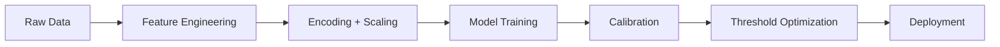

<div align="center">

# 🚀 Ensemble Learning for Customer Churn Prediction
### <i>A Diversity-Driven Approach with Business Decision Support</i>


<br><br>


</div>

---

# ✨ Overview

A full-stack machine learning platform for **telecom customer churn prediction** that goes beyond classification by integrating:

✅ Diversity-aware ensemble learning  
✅ Calibration for trustworthy probabilities  
✅ Cost-sensitive decision optimization  
✅ Interactive business dashboards  
✅ API-based deployment architecture  
✅ Research-grade benchmarking across 14 models

---

# 🎯 Why This Project Matters

Customer churn is one of the most expensive problems in telecom.

- Acquiring a new customer costs **5–7× more** than retaining one  
- A **26.5% churn rate** can destroy long-term revenue  
- Accurate predictions alone are not enough  
- Businesses need **actionable decisions**

### Central Question

> Can diversity-aware ensemble learning outperform individual models while delivering business-ready reliability?

---

# 📊 Dataset Snapshot

| Metric | Value |
|------|------|
| Customers | 7,043 |
| Retained | 5,174 |
| Churned | 1,869 |
| Churn Rate | 26.5% |
| Raw Features | 21 |
| Engineered Features | 9 |
| Final Features | 30 |

---

# 🧠 Feature Engineering

Designed domain-informed features to improve predictive signal.

```text
AvgMonthlyCharge
ChargeIncrease
MonthlyToTotalRatio
tenure_bin
IsNewCustomer
NumServices
HasSecurity
HasSupport
AutoPay
```

### Pipeline



---

# 🏗️ Model Benchmark — 4 Learning Families

## 🌳 Tree-Based
- Random Forest
- Extra Trees
- Gradient Boosting
- AdaBoost
- Bagging
- XGBoost
- LightGBM

## 📈 Linear
- Logistic Regression

## 🌐 Kernel
- SVM (RBF)

## 🧬 Neural
- MLP (64 → 32)

---

# 🤝 Ensemble Strategies

| Method | Design |
|------|--------|
| Stacking | 6 base models + Logistic meta learner |
| Soft Voting | Probability averaging |
| Hard Voting | Majority vote |

---

# 🔬 Core Research Contribution — Diversity Matters

Most ensembles fail because their models make the **same mistakes**.

This project measures model complementarity using:

- Q-Statistic
- Disagreement Rate
- Double-Fault Rate

### Key Discovery

```text
Tree-only ensembles:
Q > 0.95  → Redundant

Mixed-family ensembles:
Q = 0.663 → Truly diverse
```

---

# 🏆 Breakthrough Result

The maximally diverse pair:

```text
{Extra Trees + Logistic Regression}
```

achieved:

```text
ROC-AUC = 0.863
```

Matching the full 6-model stacking ensemble with only **2 models**.

> 💡 Better diversity > More models

---

# 📈 Performance Results

| Model | F1 | Recall | Precision | ROC-AUC | PR-AUC |
|------|----|--------|----------|--------|-------|
| 🥇 Calibrated Stacking | **0.756** | 0.744 | 0.586 | **0.863** | 0.698 |
| Random Forest | 0.658 | 0.779 | 0.570 | 0.861 | 0.699 |
| Stacking | 0.647 | 0.784 | 0.551 | 0.863 | 0.703 |
| Logistic Regression | 0.634 | **0.817** | 0.518 | 0.861 | **0.808** |
| SVM | 0.630 | 0.623 | 0.638 | 0.845 | 0.632 |

---

# 🎯 Probability Calibration

A model with high AUC can still give poor probabilities.

Calibration ensures:

> 80% predicted churn risk ≈ 80% real churn frequency

### Example Improvement

```text
Stacking ECE:
0.152 → 0.025
```

✅ **6× better reliability**

### Best Native Calibration

```text
MLP = 0.014 ECE
```

---

# 💰 Business Cost Optimization

The default threshold (**0.50**) is rarely optimal.

### Cost Assumptions

| Error Type | Cost |
|----------|------|
| False Negative | $500 |
| False Positive | $50 |

### Optimal Thresholds

| Objective | Threshold |
|----------|----------|
| F1 Score | 0.397 |
| Business Cost | 0.14 |

### Result

# 🟢 26% Cost Reduction

---

# 🌐 Full-Stack Deployment Platform

## ⚙️ Backend

- FastAPI
- 16 REST endpoints
- Saved artifacts via Joblib
- Real-time inference

## 🎨 Frontend

- Next.js
- React
- shadcn/ui
- Recharts

---

# 🖥️ Platform Modules

## Customer Intelligence

- Executive Summary
- Portfolio Dashboard
- Customer Lookup
- Watch List
- Segment Explorer

## Retention Tools

- What-If Simulator
- Campaign Optimizer
- A/B Test Simulator
- Revenue Impact
- Model Observatory

---

# 📡 API Endpoints

```http
GET  /health
POST /predict
GET  /portfolio/summary
GET  /portfolio/customers
POST /whatif
POST /campaign/optimize
GET  /models/comparison
GET  /models/diversity
GET  /models/calibration
GET  /models/des
```

---

# 🗂️ Repository Structure

```text
Churn-Prediction/
│
├── backend/              # FastAPI services
├── frontend/             # Next.js dashboard
├── models/               # Training modules
├── common/               # Shared utilities
├── artifacts/            # Saved models + preprocessors
├── reports/              # Evaluation visuals
├── train.py              # Main pipeline
├── tune.py               # Hyperparameter search
└── README.md
```

---

# 🚀 Quick Start

## 1️⃣ Clone Repository

```bash
git clone https://github.com/yourusername/churn-prediction.git
cd churn-prediction
```

## 2️⃣ Install Dependencies

```bash
pip install -r requirements.txt
```

## 3️⃣ Train Models

```bash
python train.py
```

## 4️⃣ Run Backend

```bash
uvicorn backend.api:app --reload
```

## 5️⃣ Run Frontend

```bash
npm install
npm run dev
```

---

# 📌 Key Contributions

### ✅ Diversity-Driven Ensemble Design
2 models matched a 6-model stack.

### ✅ 4-Family Benchmarking
Tree, Linear, Kernel, Neural models compared fairly.

### ✅ Production Calibration
6× probability quality improvement.

### ✅ Cost-Aware Decisions
26% lower business loss.

### ✅ End-to-End Product
Research + ML + Backend + Frontend + Analytics.

---

# 🔭 Future Roadmap

- Drift detection
- Real-time streaming inference
- Cloud deployment
- Docker + CI/CD
- Temporal behavior features
- SMOTE / ADASYN
- Larger DSEL for DES
- Optuna tuning

---

# 👩‍💻 Author

### Zaynab Raounak
Engineering Student • Machine Learning • AI Systems • Full-Stack Development

---

<div align="center">

## ⭐ If You Like This Project

Give it a star and share it.

</div>
